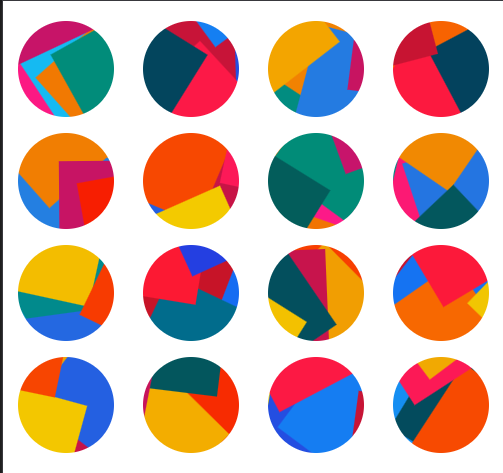
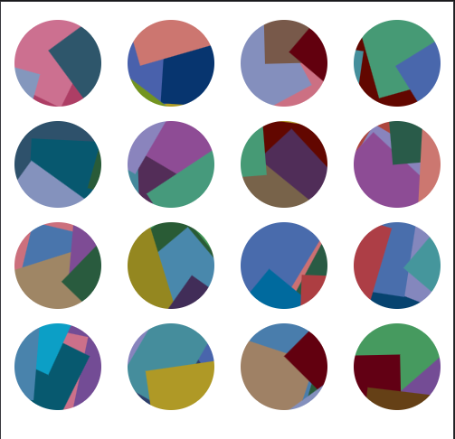

# Jazzicon Java

## Jazzy Identicons

## Introduction

Say goodbye to boring blocky identicons that look like they came out of the 70s, and replace them with jazzy, colorful
collages that more likely came out of the 80's.

## Acknowledgements

This is a port of [Mirshko's Typescript Jazzicon](https://github.com/mirshko/jazzicon-ts) with some
modifications to better fit Java ecosystem while taking some inspirations
from [Uparix's Jazzicon](https://github.com/uparix/JazzIcon) as well.

## Installation

### Requirements

- Java 21+
- A build system, either Maven or Gradle

### Maven

```xml

<dependency>
  <groupId>io.github.mikeychowy.jazzicon</groupId>
  <artifactId>jazzicon</artifactId>
  <version>${jazzicon.version}</version>
</dependency>
```

### Gradle

```groovy
dependencies {
  implementation("io.github.mikeychowy.jazzicon:jazzicon:1.0.0")
}
```

## Usage

Generate the icon to either direct String, OutputStream, or even a Writer

### Basic Example

```java
import io.github.mikeychowy.jazzicon.JazzIcon;

@SuppressWarnings("UnnecessaryModifier")
public static void main(String[] args) {
  JazzIcon jazzIcon = new JazzIcon();
  // generate to string and use directly
  String svg = jazzIcon.generateIcon("Harry");
  // generate to an output stream
  try (ByteArrayOutputStream outputStream = new ByteArrayOutputStream()) {
    jazzIcon.generateIconToStream("Harry", outputStream);
    String streamSvg = outputStream.toString(StandardCharsets.UTF_8);
  }

  // generate to a writer
  try (StringWriter osw = new StringWriter()) {
    jazzIcon.generateIconToWriter("Harry", osw);
    String writerSvg = osw.toString();
  }
}
```

### Saving to File

```java
import java.io.FileOutputStream;
import java.nio.file.Files;
import java.nio.file.Path;
import java.nio.file.Paths;
import org.apache.commons.io.FileUtils;
import io.github.mikeychowy.jazzicon.JazzIcon;

@SuppressWarnings("UnnecessaryModifier")
public static void main(String[] args) throws IOException {
  // this is just an example, create a temporary file to save the SVG into
  Path tmpDir = Paths.get(FileUtils.getTempDirectory().getAbsolutePath(), "jazzicon");
  Path tmpFilePath = Files.createTempFile(tmpDir, "jazzicon", ".svg");
  FileUtils.createParentDirectories(tmpFilePath.toFile());

  try (FileOutputStream out = new FileOutputStream(tmpFilePath.toFile(), true)) {
    // use generateIconToStream
    new JazzIcon().generateIconToStream("Harry", out);
    out.flush();
  }
  // you have your svg file at the ready
}
```

### Adding Classes and/or Styles to the SVG root element

```java
import io.github.mikeychowy.jazzicon.JazzIcon;

@SuppressWarnings("UnnecessaryModifier")
public static void main(String[] args) {
  JazzIcon jazzIcon = new JazzIcon();

  // add single class
  jazzIcon.addSvgClass("show");
  // add using varargs
  jazzIcon.addSvgClasses("py-5", "px-2");
  // add using a list
  jazzIcon.addSvgClasses(List.of("md:py-3", "md:px-1"));

  // styles have the same signatures as classes
  // add single style
  jazzIcon.addSvgStyle("color: red;");
  // add using varargs
  jazzIcon.addSvgClasses("padding-top: 0;", "padding-bottom: 0;");
  // add using a list
  jazzIcon.addSvgClasses(List.of("padding-left: 2rem;", "padding-right: 2rem;"));

  // the generated SVG will contain the classes and styles above
  String svg = jazzIcon.generateIcon("Harry");
}
```

### Supplying an interceptor to body generation right before appending tail

#### DISCLAIMER: ANYTHING YOU DO IN THE CONSUMER TO THE SVG IS NOT GUARANTEED TO BE SAFE (except of it being thread-safe), I TAKE NO RESPONSIBILITY FOR YOUR OPERATION(S)

```java
import io.github.mikeychowy.jazzicon.JazzIcon;

@SuppressWarnings("UnnecessaryModifier")
public static void main(String[] args) throws IOException {
  JazzIcon jazzIcon = new JazzIcon();
  // simple example of appending text element right before the svg is closed (tail)
  Consumer<Writer> addingTextConsumer = writer -> {
    try {
      writer.append("<text x=\"50%\" y=\"50%\" text-anchor=\"middle\" dominant-baseline=\"middle\" " +
          "class=\"fill-white font-bold text-[30px] font-sans\">ICON</text>");
    } catch (IOException e) {
      throw new RuntimeException(e);
    }
  };

  // generate to an output stream
  try (ByteArrayOutputStream outputStream = new ByteArrayOutputStream()) {
    jazzIcon.generateIconToStream("Harry", outputStream, addingTextConsumer);
    String streamSvg = outputStream.toString(StandardCharsets.UTF_8);
  }

  // generate to a writer
  try (StringWriter osw = new StringWriter()) {
    jazzIcon.generateIconToWriter("Harry", osw, addingTextConsumer);
    String writerSvg = osw.toString();
  }
}
```

### Using your own color palette

```java
import io.github.mikeychowy.jazzicon.ColorPalettes;
import io.github.mikeychowy.jazzicon.JazzIcon;

@SuppressWarnings("UnnecessaryModifier")
public static void main(String[] args) {
  JazzIcon jazzIcon = new JazzIcon();
  // custom palette of black and white shades only, why would you do this to yourself, I will never know
  // if you only have a set of 3 colors, shape count needs to be 2
  // the validation is (shapeCount + 1) <= colorPalette.getColors().size()
  ColorPalettes emoPalette =
      new ColorPalettes(Set.of("#FFFFFF", "#000000", "#F8F8FF", "#2F4F4F", "#F5FFFA", "#080808"));

  // use the new palette
  jazzIcon.setBaseColors(emoPalette);

  // generate to string and use directly
  String svg = jazzIcon.generateIcon("Harry");
}
```

### Convenience methods to generate initials of a name on top of the icon (this is using the svgBodyInterceptor syntax internally)

```java
import io.github.mikeychowy.jazzicon.ColorPalettes;
import io.github.mikeychowy.jazzicon.JazzIcon;

@SuppressWarnings("UnnecessaryModifier")
public static void main(String[] args) {
  JazzIcon jazzIcon = new JazzIcon();

  // generate to string and use directly
  // this will generate the icon with the initials of the name on top of the icon
  // (in this particular case, "H")
  String svg = jazzIcon.generateIconWithInitials("Harry");

  // give classes and/or styles directly to the initials
  String svgWithInitialClassesAndStyles =
      jazzIcon.generateIconWithInitials("Harry", List.of("text-white"), List.of("padding:0;"));

  // generate to an output stream
  try (ByteArrayOutputStream outputStream = new ByteArrayOutputStream()) {
    jazzIcon.generateIconWithInitialsToStream("Harry", outputStream);
    String streamSvg = outputStream.toString(StandardCharsets.UTF_8);
  }

  // generate to a writer
  try (StringWriter osw = new StringWriter()) {
    jazzIcon.generateIconWithInitialsToWriter("Harry", osw);
    String writerSvg = osw.toString();
  }
}
```

### Builder Pattern for setting up JazzIcon generator

#### Note: for all the builder methods, there is an equivalent fluent setter API counter-part

```java
import io.github.mikeychowy.jazzicon.ColorPalettes;
import io.github.mikeychowy.jazzicon.JazzIcon;
import org.hipparchus.random.JDKRandomGenerator;

@SuppressWarnings({"UnnecessaryModifier", "ResultOfMethodCallIgnored"})
public static void main(String[] args) {
  JazzIcon.builder()
      // use your own padding allow list
      .withAllowedCharactersForPaddingText("ABC")
      // use another color palette
      .withBaseColors(ColorPalettes.CATPUCCIN_FRAPPE)
      // in case you want the color shift to wobble more
      .withWobble(50)
      // in case you want more/fewer shapes to be generated in the svg
      .withShapeCount(5)
      // in case you want to bring your own implementation or the default JDK random
      .withRandomGenerator(new JDKRandomGenerator(new SecureRandom()))
      // you can now use the class
      .build();

  // or use fluent setter style
  new JazzIcon()
      .setAllowedCharactersForPaddingText("ABC")
      .setBaseColors(ColorPalettes.CATPUCCIN_FRAPPE)
      .setWobble(50)
      .setShapeCount(5)
      .setRandomGenerator(new JDKRandomGenerator(new SecureRandom()));
}
```

## Dependencies

- [ColorMath JVM](https://github.com/ajalt/colormath): to rotate colors
- [Hipparchus](https://github.com/Hipparchus-Math/hipparchus): for RandomGenerator implementations
- [JSpecify Annotations](https://github.com/jspecify/jspecify): for static nullability checking
- [Apache Commons Lang3](https://commons.apache.org/proper/commons-lang/): general language purposes, mainly
  StringUtils#isNotBlank usage
- [MachineZoo's NoException](https://noexception.machinezoo.com/): to circumnavigate try-catch syntax in lambdas, I like
  functional-inspired coding style

## Notes

While I cannot guarantee any correctness of usage on your part, especially when using the svgBodyInterceptor.

I try my best to reach 100% code coverage in unit tests and doing meaningful tests such as the validity of my generated
svg xml structure
using Apache Batik SVG parser, and the safety of it using [bgalek's safe-svg](https://github.com/bgalek/safe-svg).

Hopefully this convinces you that I won't be doing any weird injections or attacks using the generated svg.

I just like JazzIcon and want to port it into Java

## Color Palettes Examples

### JAZZ_ICON default colors



### CHART colors

