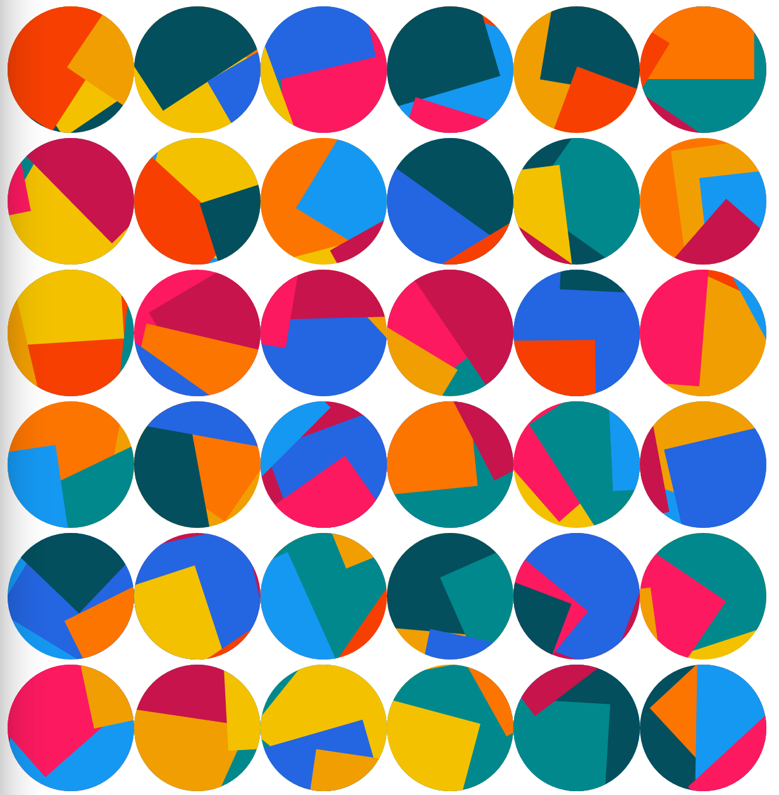

# Jazzicon Java

## Jazzy Identicons

Say goodbye to boring blocky identicons that look like they came out of the 70s, and replace them with jazzy, colorful
collages that more likely came out of the 80's.

This is an almost 1-to-1 port of [Mirshko's Typescript Jazzicon](https://github.com/mirshko/jazzicon-ts) with some
modifications to suit Java and taking some inspirations from [Uparix's Jazzicon](https://github.com/uparix/JazzIcon)



## Installation

### Maven

```xml

<dependency>
  <groupId>io.github.mikeychowy.jazzicon</groupId>
  <artifactId>jazzicon</artifactId>
  <version>${jazzicon.version}</version>
</dependency>
```

### Gradle

```groovy
dependencies {
  implementation("io.github.mikeychowy.jazzicon:jazzicon:1.0.0")
}
```

## Usage

Generate the icon to either direct String, OutputStream, or even a Writer

### Basic Example

```java
import io.github.mikeychowy.jazzicon.JazzIcon;

void main(String[] args) {
  JazzIcon jazzIcon = new JazzIcon();
  // generate to string and use directly
  String svg = jazzIcon.generateIcon("Harry");
  // generate to an output stream
  try (ByteArrayOutputStream outputStream = new ByteArrayOutputStream()) {
    jazzIcon.generateIconToStream("Harry", outputStream);
    String streamSvg = outputStream.toString(StandardCharsets.UTF_8);
  }

  // generate to a writer
  try (StringWriter osw = new StringWriter(outputStream, StandardCharsets.UTF_8)) {
    jazzIcon.generateIconToWriter("Harry", osw);
    String writerSvg = osw.toString();
  }
}
```

###                   

## Dependencies

- [ColorMath JVM](https://github.com/ajalt/colormath): to rotate colors
- [Hipparchus](https://github.com/Hipparchus-Math/hipparchus): for RandomGenerator implementations
- [JSpecify Annotations](https://github.com/jspecify/jspecify): for static nullability checking
- [Apache Commons Lang3](https://commons.apache.org/proper/commons-lang/): general language purposes, mainly
  StringUtils#isNotBlank usage
- [MachineZoo's NoException](https://noexception.machinezoo.com/): to circumnavigate try-catch syntax in lambdas, I like
  functional-inspired coding style

## Notes

While I cannot guarantee any correctness of usage on your part, or when using the svgBodyInterceptor.

I try my best to reach 100% code coverage in unit tests and doing meaningful tests such as the validity of my generated
svg xml structure
using Apache Batik SVG parser, and the safety of it using [bgalek's safe-svg](https://github.com/bgalek/safe-svg).

Hopefully this convinces you that I won't be doing any weird injections or attacks using the generated svg.

I just like JazzIcon and wants to port it into Java